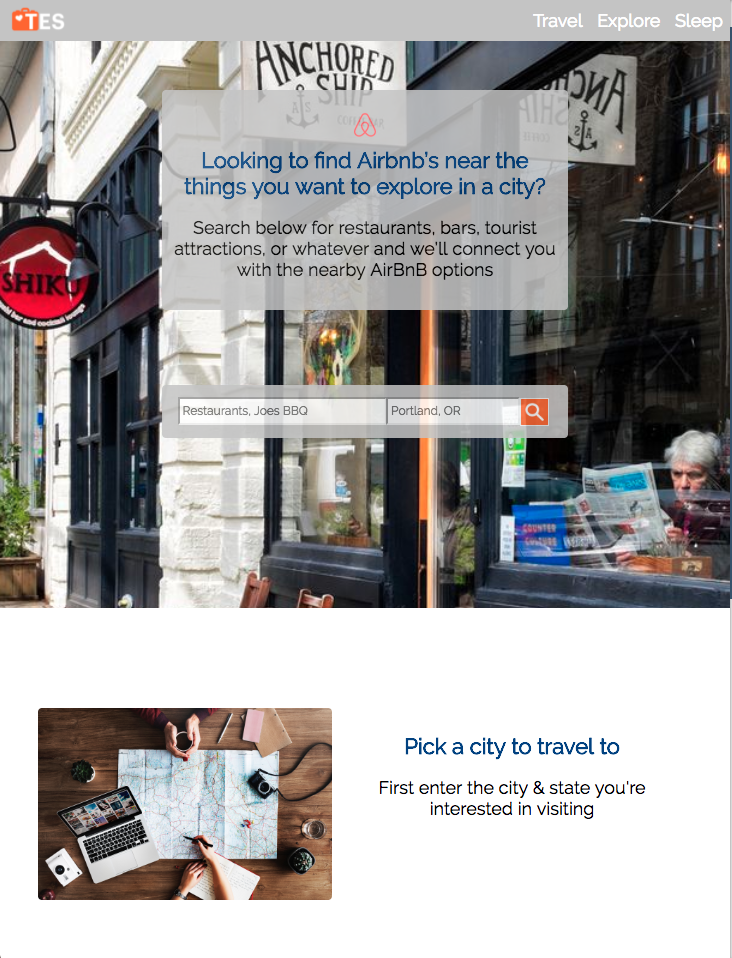

# TES | Travel Explore Sleep
https://tes-travel-explore-sleep.herokuapp.com/

# Summary
TES is an app designed to aid users with finding AirBnb's in desirable locations. If you enjoy staying near cool restaurants, coffee shops, or bars for example, TES will help you find those things, and then from the search results you can select the AirBnbs nearby. You will be taken to the AirBnb website so you can refine your Airbnb search by date, or additional parameters that matter to you.

# Motivation
I love staying in AirBnbs that are within walking distance to restaurants and coffee shops. Till now, I've have to have two tabs open, one with a AirBnb results mapped and another with yelp/google results on a map. Then I had to zoom in and move both around to get them to be lined up. This is silly! Thus TES was born.

# Technology used
* JavaScript/ Jquery
* HTML
* CSS
* Node.js

# Screenshots
### Home page-----

### Results page- mobile view-----

### Results page- full screen view----

